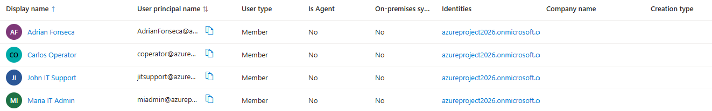
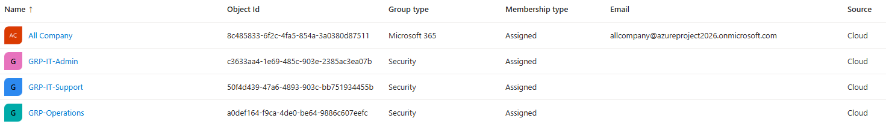
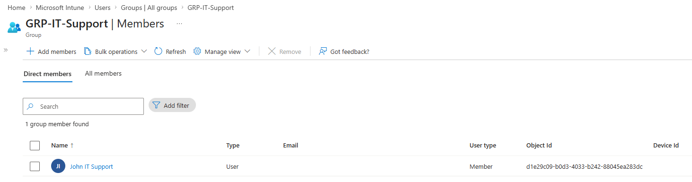

# Entra ID — User & Group Design

This document covers the identity foundation built on top of the existing Azure Landing Zone Lab: users, security groups, and role structure simulating a real organizational hierarchy.

---

## Overview

To extend the Azure Landing Zone Lab beyond infrastructure-as-code, a Microsoft 365 E5 trial tenant was provisioned to practice identity and endpoint management — specifically Entra ID user/group administration and Microsoft Intune device management, both directly relevant to enterprise IT support roles.

---

## Users Created

Three users were created to simulate distinct organizational roles found in a typical manufacturing/enterprise IT environment:

| Display Name | User Principal Name | Simulated Role |
|---|---|---|
| John IT Support | jitsupport@\<tenant\>.onmicrosoft.com | IT Support L1 — helpdesk, ticket handling |
| Maria IT Admin | miadmin@\<tenant\>.onmicrosoft.com | IT Administrator — elevated access |
| Carlos Operator | coperator@\<tenant\>.onmicrosoft.com | Plant/Operations user — restricted profile |

---

## Security Groups

Security groups were created to manage access and policy assignment at scale rather than per-user — the standard enterprise practice for both RBAC and Intune policy targeting.

| Group Name | Type | Membership | Purpose |
|---|---|---|---|
| GRP-IT-Support | Security | John IT Support | Target group for helpdesk-tier policies and permissions |
| GRP-IT-Admin | Security | Maria IT Admin | Target group for elevated administrative access |
| GRP-Operations | Security | Carlos Operator | Target group for production/plant-floor device policies |

Each group's membership was configured as **Assigned** (static), matching how most organizations manage core role-based groups before layering dynamic membership rules on top.

---

## Design Rationale

This structure mirrors the pattern used in real manufacturing/enterprise environments — including the one this lab is built to prepare for — where:

- **IT Support** and **IT Admin** roles are separated to apply least-privilege access (support staff don't need admin-level permissions to do their job).
- **Operations/plant-floor** users are isolated into their own group so that device compliance and security policies can be stricter and tailored to production environments, where uptime and security matter more than user flexibility.
- Group-based targeting means policies, app assignments, and access can be managed at scale — adding a new support technician means adding them to one group, not reconfiguring policies individually.

---

## Connection to Existing Azure Landing Zone Lab

This identity layer complements the RBAC governance already implemented in the [Azure Landing Zone Lab](../README.md):

| Existing RBAC (Landing Zone) | New Layer (Entra ID Groups) |
|---|---|
| Developer → Contributor (rg-lab-spoke) | Could map to GRP-IT-Admin |
| Operator → Reader + VM Contributor | Could map to GRP-IT-Support |
| Auditor → Reader (subscription) | Could map to a future GRP-Auditors group |

This shows the natural extension from infrastructure RBAC to full identity and device governance — the same principle (least privilege, role-based access) applied consistently across both layers.

---

## Author

**Adrián Fonseca**
[LinkedIn](https://linkedin.com/in/afc2806) · [GitHub](https://github.com/ODR3N) · [Portfolio](https://odr3n.github.io)
