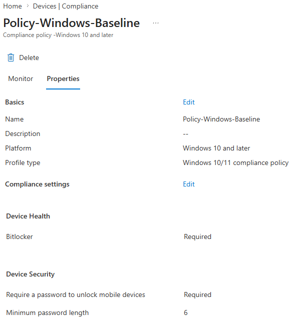
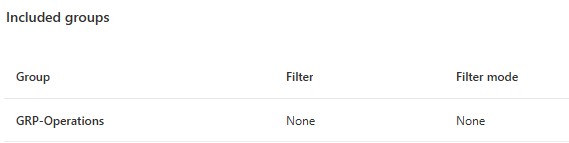
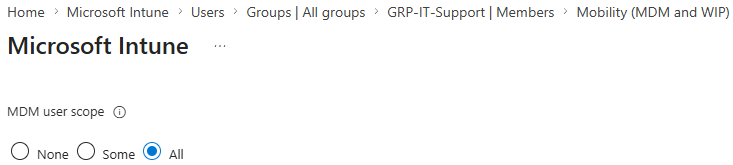
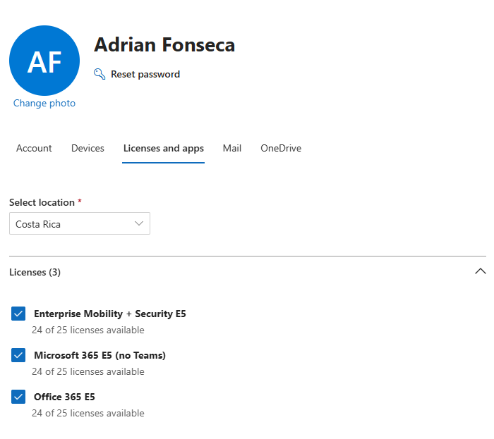
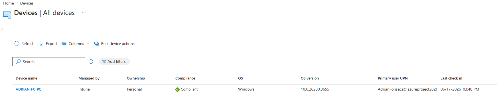
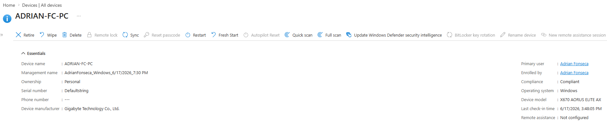

# Microsoft Intune — Device Compliance & Enrollment

This document covers the Intune configuration built on top of the Entra ID identity foundation: compliance policy design, MDM scope configuration, licensing troubleshooting, and real device enrollment.

---

## Overview

To gain hands-on experience with endpoint management — a core requirement for enterprise IT support roles — a Windows device was enrolled into Microsoft Intune within the same Microsoft 365 E5 trial tenant used for the Entra ID lab, and a compliance policy was created and assigned to a specific user group.

---

## Compliance Policy

A baseline compliance policy was created to define minimum security requirements for Windows devices, then assigned to **GRP-Operations** — simulating a stricter policy for plant-floor/production devices, where security posture matters more than user convenience.

**Policy: `Policy-Windows-Baseline`**

| Setting | Requirement |
|---|---|
| Platform | Windows 10 and later |
| BitLocker | Required |
| Password to unlock device | Required |
| Minimum password length | 6 characters |
| Action for noncompliance | Mark device as not compliant |

The policy was assigned specifically to **GRP-Operations**, not to all users — demonstrating targeted policy application rather than a blanket organization-wide rule.

---

## MDM Enrollment Configuration

For Intune to manage devices, the tenant's MDM (Mobile Device Management) user scope must be configured. This was set to **All**, enabling any user in the tenant to enroll a device into Intune.

---

## Real Troubleshooting Encountered

This lab wasn't a clean, linear walkthrough — several real configuration issues had to be diagnosed and resolved, which is arguably more valuable than a frictionless setup:

### Issue 1 — "You don't have access" / Missing service plan (Error 401)
**Symptom:** Accessing Intune returned an access error referencing a "Missing service plan."
**Root cause:** The tenant's default license (Office 365 E5) does not include Intune. Office 365 E5 and Microsoft 365 E5 are different bundles — only the latter includes Enterprise Mobility + Security (where Intune lives).
**Resolution:** Verified available licenses under the user's **Licenses and apps** panel in the Microsoft 365 admin center, then assigned **Microsoft 365 E5 (no Teams)**, which included the Intune service plan.

### Issue 2 — Automatic MDM enrollment unavailable
**Symptom:** Attempting to enable automatic MDM enrollment via Azure AD Join returned: *"Automatic MDM enrollment is available only for Microsoft Entra ID Premium subscribers."*
**Root cause:** Automatic enrollment via Azure AD Join requires Entra ID Premium, which wasn't part of the active license at that point.
**Resolution:** Switched to manual enrollment via the **Company Portal** app, which doesn't require Entra ID Premium — just a valid Intune license on the user account (resolved by Issue 1's fix).

### Issue 3 — Company Portal blocked access
**Symptom:** Company Portal displayed: *"IT admin needs to assign license for access."*
**Root cause:** Same licensing gap as Issue 1 — the user account didn't yet have the Intune-inclusive license applied.
**Resolution:** Once the Microsoft 365 E5 license was assigned and had time to propagate (~5–10 minutes), Company Portal allowed the enrollment to proceed.

---

## Result — Device Enrolled and Compliant

After resolving the licensing chain, the Windows device was successfully enrolled and reported as **Compliant** against the assigned policy.

| Device Name | Managed By | Ownership | Compliance | OS |
|---|---|---|---|---|
| ADRIAN-FC-PC | Intune | Personal | ✅ Compliant | Windows |

---

## Key Takeaways

- **Licensing is a common real-world blocker.** Several distinct Microsoft 365/Intune-adjacent SKUs exist (Office 365 E5, Microsoft 365 E5, EMS E5), and knowing which one actually includes the service you need is a practical troubleshooting skill — not just a checkbox in a tutorial.
- **Automatic vs. manual enrollment paths differ by license tier.** Azure AD Join's automatic MDM enrollment depends on Entra ID Premium; manual enrollment via Company Portal is the fallback and is itself the standard method many organizations use deliberately.
- **Group-targeted policies, not blanket policies.** The compliance policy was scoped to a specific group (GRP-Operations) rather than "All Devices," reflecting how real organizations differentiate policy strictness by department or device purpose.

---

## Author

**Adrián Fonseca**
[LinkedIn](https://linkedin.com/in/afc2806) · [GitHub](https://github.com/ODR3N) · [Portfolio](https://odr3n.github.io)
